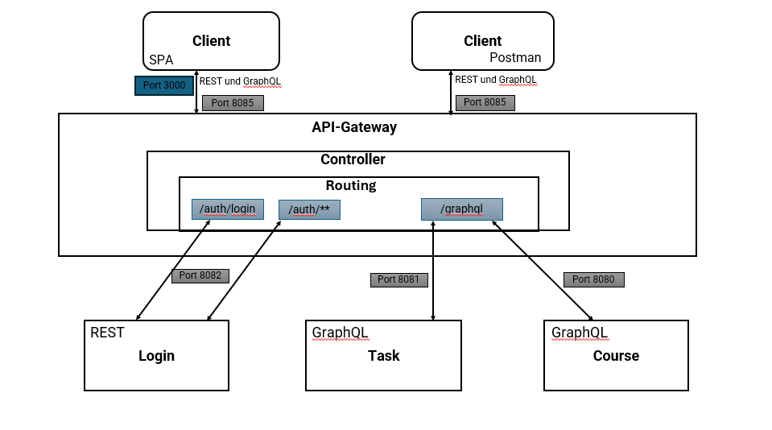

# Markdown der Systemarchitetkur

---
### Grafische Darstellung der Backends, ihrer Web-Services mit API's und dem API Gateway

#### Übersicht
Diese Markdown beschreibt die Systemarchitektur des Lernsystems, das aus mehreren Backend-Services besteht, die durch ein API Gateway mit dem Client verbunden wird. Die Architektur umfasst verschiedene Schichten, die jeweils spezifische Aufgaben erfüllen.

#### Anwendungsschicht:
Die Applikationsschicht modelliert die Softwarekomponenten wie das API-Gateway und die Backend-Systeme für Login, Aufgabenverwaltung und Kursverwaltung. Diese Komponenten stellen die benötigten Dienste zur Verfügung und ermöglichen die Umsetzung der fachlichen Anforderungen.

#### Technologie-Schicht:
Die Technologieschicht zeigt die physische Infrastruktur wie PCs, Webanwendungen, Single Page Application (SPA) und Postman, die den Betrieb der Anwendungen unterstützen. Er beschreibt, wie Geräte und Netzwerke die übergeordnete Softwareschicht ermöglichen.

#### Ports
Die Ports definieren die spezifischen Netzwerkadressen, über die, die verschiedenen Services über das API Gateway  erreichbar sind:
- **API Gateway**: Port 8085
- **Login-Service**: Port 8082
- **Task-Service**: Port 8081
- **Course-Service**: Port 8080

#### Controller
- **API Gateway**: `GatewayController.java`
  - Nutzt Routing, um Anfragen an die entsprechenden Microservices weiterzuleiten. Es wird nur ein Controller verwendet für alle drei Services genutzt.
- **Login-Service**: `LoginController.java`
  - Handhabt die Benutzeranmeldung und -registrierung. + CRUD Operationen.
- **Task-Service**: `TaskController.java`
  - Verarbeitet CRUD-Operationen für Aufgaben und ermöglicht eine Übersicht der To-Do-List, darin wird der aktuelle Stand einer einzelnen Aufgabe gezeigt.
- **Course-Service**: `CourseController.java`
  - Verarbeitet CRUD-Operationen für Kurse und Kursinhalte.

### Clientseitige Möglichkeiten der Anwendungsnutzung

Folgende clientseitigen Anwendungsnutzungen wurden gewählt, um auf das System und die API's zuzugreifen:

* Single Page Application (SPA)
* Postman 

Die Gruppe entschied sich für Postman und die Single Page Application, weil SPA eine benutzerfreundliche Oberfläche bietet, um die API-Endpunkte einfach zu testen, während Postman eine effiziente Möglichkeit für automatisierte API-Interaktionen ermöglicht.

### API Technologien
Das Team entschied sich für die API Technologien ***REST*** und ***GraphQL***. Für unsere Lernsystem-Anwendung nutzen wir REST nur für den Webservice des Login da es eine einfache Umsetzung für die Authentifizierung und Autorisierung von Benutzern bietet. GraphQL nutzen wir für die Webservices Aufgabenverwaltung und Kursverwaltung, da es eine effiziente Möglichkeit bietet, Datenoperationen wie Erstellen, Löschen und Aktualisieren durchzuführen.

